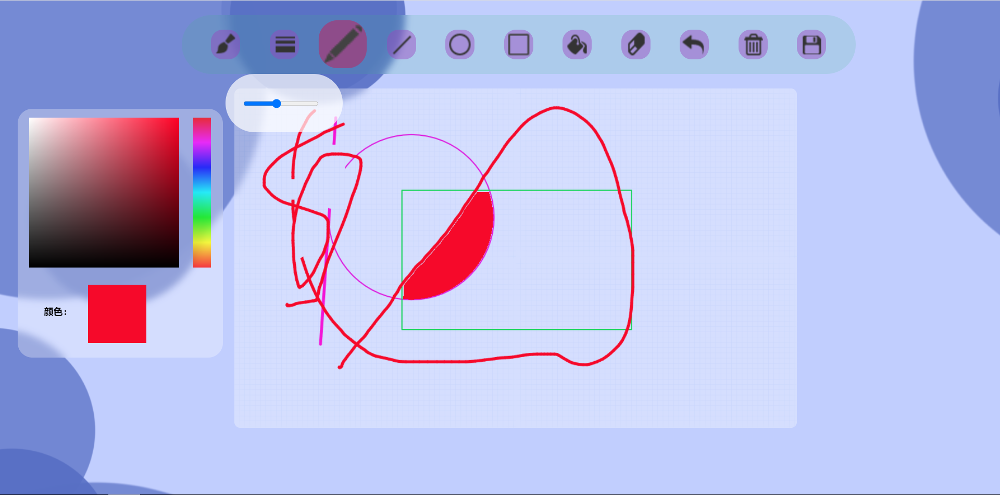

# 静态网页画板


静态网页画板，可以进行一些简单的绘画。  

画板包含以下功能：
- 添加文字
- 铅笔和直线
- 圆形和矩形
- 撤销和清除
- 橡皮擦和填充色块
- 保存图片

## 目录

- [上手指南](#上手指南)
    - [开发前的配置要求](#开发前的配置要求)
    - [安装步骤](#安装步骤)
- [Demo](#Demo)
- [文件目录说明](#文件目录说明)
- [使用到的框架](#使用到的框架)
- [如何参与开源项目](#如何参与开源项目)
- [版本控制](#版本控制)
- [作者](#作者)
- [贡献者](#贡献者)
- [版权说明](#版权说明)
- [鸣谢](#鸣谢)

### 上手指南

###### 开发前的配置要求

    请使用Chrome浏览器以避免不适配等系列问题

###### **安装步骤**

1. Get a free API Key at [https://github.com/buyanne/ArtBoard](https://github.com/buyanne/ArtBoard)
2. Clone the repo

```sh
git clone https://github.com/buyanne/ArtBoard.git
```

### Demo



### 文件目录说明

```
Artboard
├── LICENSE.txt   //版权信息文件
├── README.md
├── 更新文档.md   //一些版本更新的信息
├── index.html   //html主界面
├── _config.yml  //线上配置文件
├── /JavaScript/
│  ├── draw.js
│  ├── jquery.min.js
│  ├── main.js
│  └── palette.js
├── /CSS/
│  ├── style.css
│  └── styleButton.js
└── /Resource/
│  └── /Image/
│  ├── background.png
│  ├── background1.png
│  ├── bkg.pnd
│  ├── circle.png
│  ├── clip.png
│  ├── color.png
│  ├── cursor.gif
│  ├── download.png
│  ├── draw.png
│  ├── fill.png
│  ├── handwriting.png
│  ├── line.png
│  ├── pencil.png
│  ├── rubber.png
│  ├── rubbish.png
│  ├── save.png
│  ├── size.png
│  └── square.png


```

### 使用到的框架

- 使用原生JavaScript,HTML，Css 完成

### 如何参与开源项目

贡献使开源社区成为一个学习、激励和创造的绝佳场所。你所作的任何贡献都是**非常感谢**的。

1. Fork the Project
2. Create your Feature Branch (`git checkout -b feature/AmazingFeature`)
3. Commit your Changes (`git commit -m 'Add some AmazingFeature'`)
4. Push to the Branch (`git push origin feature/AmazingFeature`)
5. Open a Pull Request

### 版本控制

该项目使用Git进行版本管理。

### 作者

Buyanne && Wuduhuange

*您也可以在贡献者名单中查看所有参与该项目的开发者。*

### 贡献者
- Buyanne
- Wuduhuange

### 版权说明

该项目签署了MIT 授权许可，详情请参阅 [LICENSE.txt](https://github.com/buyanne/ArtBoard/blob/main/LICENSE)

### 鸣谢

- 感谢所有使用或参与本项目的人
- 感谢 [GitHub Pages](https://pages.github.com)对项目的支持
- 感谢[choosealicense](https://choosealicense.com)的相关支持
- 感谢[shields.io](https://shields.io)对文档优化的支持


